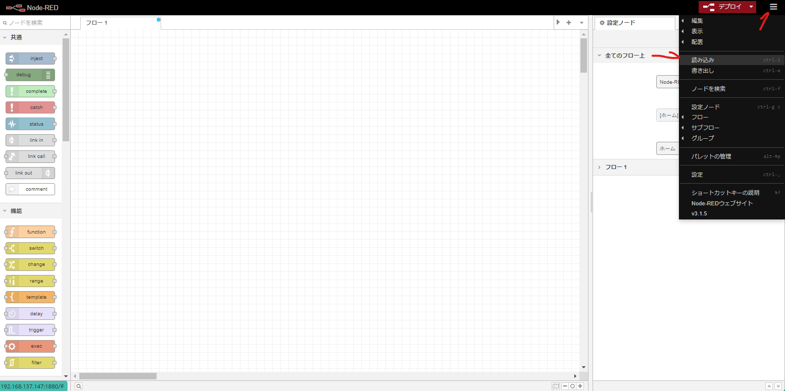
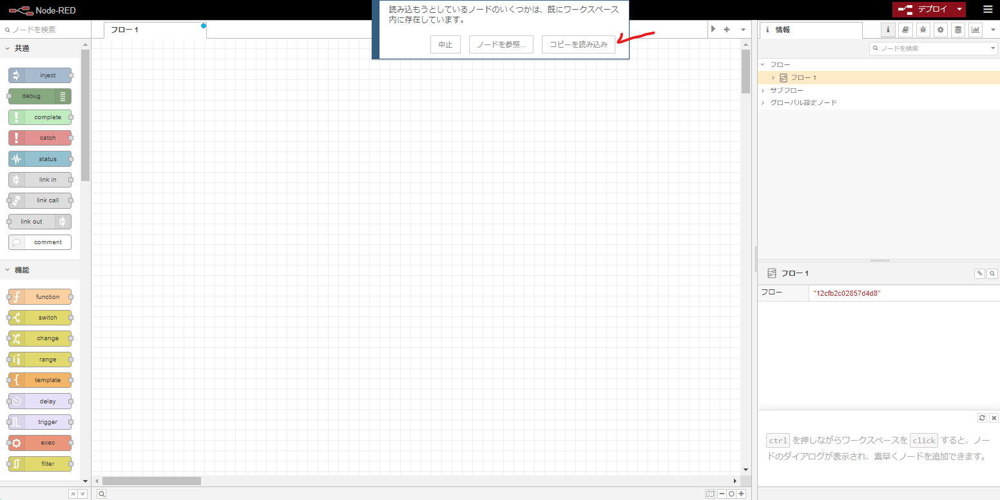
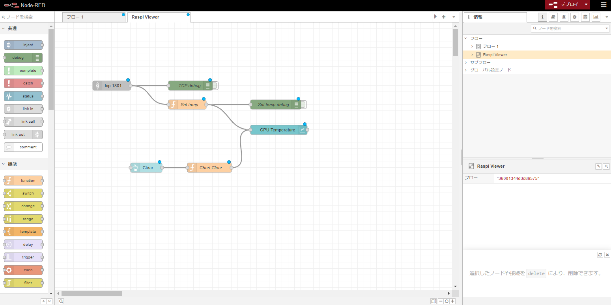
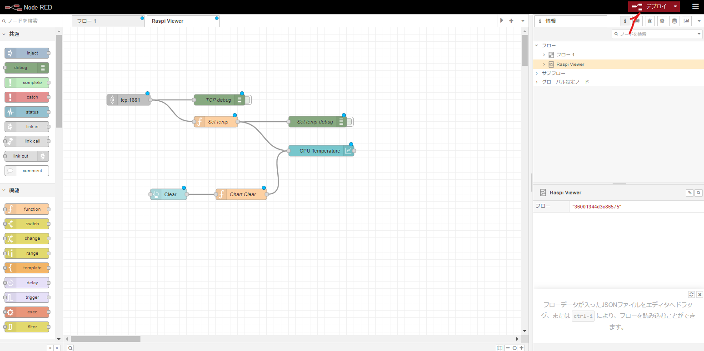
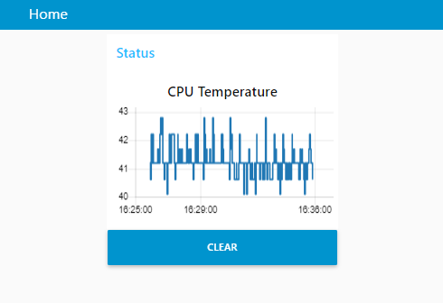

# NodeRedSample
Node REDのサンプルプロジェクトです。（ラズパイZero WHにて実験）

## 環境構築
- dockerをインストールします。<br>
https://nodered.jp/docs/getting-started/docker
- リポジトリをクローンします。<br>
```sh
$ git clone https://github.com/taogya/NodeRedSample.git
$ cd NodeRedSample/
```
- Node REDを起動します。(node-red-dashboard が既に含まれています)<br>
```sh
$ mkdir data
$ sudo systemctl enable docker
$ sudo docker compose -f "docker-compose.yml" up -d
```
- サーバーのIPを確認します。
```sh
$ ifconfig | grep inet | cut -d: -f2 | awk '{ print $2}' | grep -vE "^(127\..*|172\..*|\s*)$"
192.168.137.147
```
- ラズパイはWi-Fiに接続しています。<br>
  同じネットワーク内にあるパソコンから以下にアクセスします。<br>
  http://192.168.137.147:1880

## ラズパイの温度をグラフ化
`vcgencmd`コマンドを使用して温度を取得します。<br>
タイムスタンプと温度を文字列でNode REDにTCP送信します。(localhost:1881)<br>
Node REDは受信したデータをチャートに表示します。

### クライアント側
- Node Red側へ1秒周期に温度をTCP送信する以下のコマンドを実行します。
```sh
$ while true
do
  temperature=$(vcgencmd measure_temp | cut -d= -f2 | cut -d\' -f1)
  timestamp=$(date +"%Y-%m-%d %H:%M:%S")
  echo -e "$timestamp,$temperature"
  echo -e "$timestamp,$temperature" | nc -q 1 localhost 1881 -v
  sleep 1
done
```

### サーバー側
1. Node REDを開き右上読み込みから以下ファイルを読み込みます。<br>
  [raspi_sample_nodes.json](nodes/raspi_sample_nodes.json)<br>
  <br>
  <br>
  
1. 右上にあるデプロイをクリックします。<br>
  
1. 以下URLを開きます。<br>
  http://192.168.137.147:1880/ui <br>
  

> [!NOTE]
> Node REDを停止する場合は以下を実行します。<br>
```sh
$ docker compose -f "docker-compose.yml" down
```
